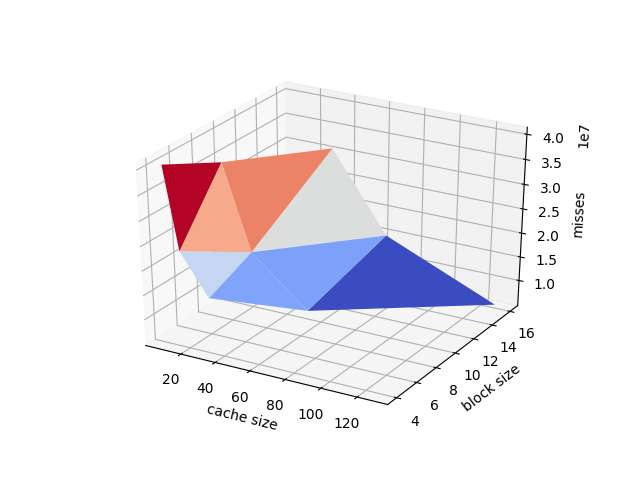

# Exercício 2

### Opção escolhida
Foi escolhida a opção de se fazer o teste somente com L1-i e L1-d para quatro programas diferentes.

### Como as medições serão feitas
Os parâmetros a serem alterados e medidos para as caches serão: **Tamanho da cache**, **Tamanho do bloco** e **Associatividade**

Para a simplificação e diminuição do tempo de teste, algumas medidas foram tomadas:
- Serão usados os mesmos valores de **Tamanho da cache**, 
**Tamanho do bloco** e **Associatividade** para ambas as caches, de dados e de instruções.
- Para cada parâmetro teremos 3 valores possíveis: Um Grande, um Médio e um Pequeno.
- Esses tamanhos serão calculados em relação à valores reais de um processador de consumidor. Os tamanhos Grande e Pequeno serão calculados em relação ao tamanho Médio, que será igual ao valor real do processador de consumidor.
- Os valores utilizados para o processador Médio, serão:
  - **Cache L1-i**
    - Cache size: 32KB
    - Cache block size: 8KB
    - Associativity: 4
  - **Cache L1-d**
    - Cache size: 32KB
    - Cache block size: 8KB
    - Associativity: 4
   - O valor baixo é igual à metade do valor médio. E o valor Grande, por sua vez, é igual ao dobro do valor médio.
   
## Como foram feitos os testes
Os testes foram feitos em quatro programas diferentes: `gzip`,`gcc`,`lucas` e `mesa`.

Para cada prgrama, foi foram rodados 27 testes no `DineroIV`. O númeor 27 representa uma combinaço de três parâmetros(cache size, bock size e associativity) com 3 valores possíveis, cada (Pequeno, Médio e Grande). Os misses das duas caches(Instruço e dados) eram as sadas dos testes.

O script abaixo, realiza esses testes e gera um arquivo `CSV` com todas as combinações de valores e suas respectivas respostas:
```python
import sys
import subprocess

def GetMisses(trname,l1_isize=32,l1_ibsize=4, l1_iassoc=8 ,l1_dsize=32,l1_dbsize=4, l1_dassoc=8, maxtrace='20'):
    command = ['../dineroIV','-informat','s','-trname',
                                      trname,'-maxtrace', maxtrace,'-l1-isize',
                                      str(l1_isize)+'K','-l1-dsize',str(l1_dsize)+'K','-l1-ibsize',str(l1_ibsize)+'K',
                                      '-l1-dbsize',str(l1_dbsize)+'K','-l1-iassoc',str(l1_iassoc),'-l1-dassoc',str(l1_dassoc)]
    #print("COMMAND: "," ".join(command))
    output = subprocess.check_output(command)
    output = output.decode("utf-8").replace("\\n","\n").replace("\t","")
    output = output.split("\n")
    output = [x for x in output if x.find("Misses")>=0]
    output = [x.split() for x in output ]
    result = []
    for i in range(len(output)):
        result.append(output[i][2])
    return result

consumerCPU = {'size':32, 'bsize':8 , 'assoc':4 }
factor=[0.5,1,2]

def eprint(*args, **kwargs):
    print(*args, file=sys.stderr, **kwargs)

if __name__=="__main__":
    tentativa = 1;
    if len(sys.argv) == 1:
        eprint ("ERROR: Needs program name to test");
        exit()
    eprint("-----------SCRIPT STARTED------------")
    print('"'+sys.argv[1]+'"')
    print('"size", "block size", "assoc", "l1-i miss", "l1-d miss"');
    for sizeFact in factor:
        for blockFactor in factor:
            for assocFactor in factor:
                eprint("----Test",tentativa,"----")
                tentativa+=1
                line = (str(int(consumerCPU['assoc']*assocFactor*consumerCPU['bsize']*blockFactor))+"K ,"+
                      str(int(consumerCPU['bsize']*blockFactor))+"K ,"+
                      str(int(consumerCPU['assoc']*assocFactor))+",")
                result = (GetMisses(sys.argv[1],int(consumerCPU['assoc']*assocFactor*consumerCPU['bsize']*blockFactor),
                                               int(consumerCPU['bsize']*blockFactor),
                                                int(consumerCPU['assoc']*assocFactor),
                                                int(consumerCPU['assoc']*assocFactor*consumerCPU['bsize']*blockFactor),
                                                int(consumerCPU['bsize']*blockFactor),
                                                int(consumerCPU['assoc']*assocFactor), maxtrace='20'))
                print(line+(", ".join(result)))
    eprint("-----------SCRIPT FINSIHED SUCCESSFULlY------------")

```
Um exemplo de saída:
**GZIP**

| size     | block size | assoc | l1-i miss | l1-d miss |
|----------|------------|-------|-----------|-----------|
| 8K       | 4K         | 2     | 4393802   | 39906057  |
| 16K      | 4K         | 4     | 944       | 20345008  |
| 32K      | 4K         | 8     | 121       | 8427284   |
| 16K      | 8K         | 2     | 1090      | 38815713  |
| 32K      | 8K         | 4     | 619       | 18836699  |
| 64K      | 8K         | 8     | 61        | 7354603   |
| 32K      | 16K        | 2     | 1000      | 35105783  |
| 64K      | 16K        | 4     | 393       | 14339842  |
| 128K     | 16K        | 8     | 13        | 4508819   |
| 8K       | 4K         | 2     | 4393802   | 39906057  |
| 16K      | 4K         | 4     | 944       | 20345008  |
| 32K      | 4K         | 8     | 121       | 8427284   |
| 16K      | 8K         | 2     | 1090      | 38815713  |
| 32K      | 8K         | 4     | 619       | 18836699  |
| 64K      | 8K         | 8     | 61        | 7354603   |
| 32K      | 16K        | 2     | 1000      | 35105783  |
| 64K      | 16K        | 4     | 393       | 14339842  |
| 128K     | 16K        | 8     | 13        | 4508819   |
| 8K       | 4K         | 2     | 4393802   | 39906057  |
| 16K      | 4K         | 4     | 944       | 20345008  |
| 32K      | 4K         | 8     | 121       | 8427284   |
| 16K      | 8K         | 2     | 1090      | 38815713  |
| 32K      | 8K         | 4     | 619       | 18836699  |
| 64K      | 8K         | 8     | 61        | 7354603   |
| 32K      | 16K        | 2     | 1000      | 35105783  |
| 64K      | 16K        | 4     | 393       | 14339842  |
| 128K     | 16K        | 8     | 13        | 4508819   |

Todos outros `CSV`s se encontram na pasta "csvs".

## Apresentação dos resultados

Utilizando o script chamado `create_graphs.py` que se encontra nessa mesma pasta nesse repositório, foi possível gerar quatro gráficos por programa testado. Os gráficos são:
- CacheSize,BlockSize X L1-i misses
- CacheSize,Associativity X L1-i misses
- CacheSize,BlockSize X L1-d misses
- CacheSize,Associativity X L1-d misses

## Resultados

## GZIP

### Instruction Cache


### Data Cache


## GCC

### Instruction Cache


### Data Cache


## Lucas

### Instruction Cache


### Data Cache


## Mesa

### Instruction Cache 


### Data Cache




## Resultados
